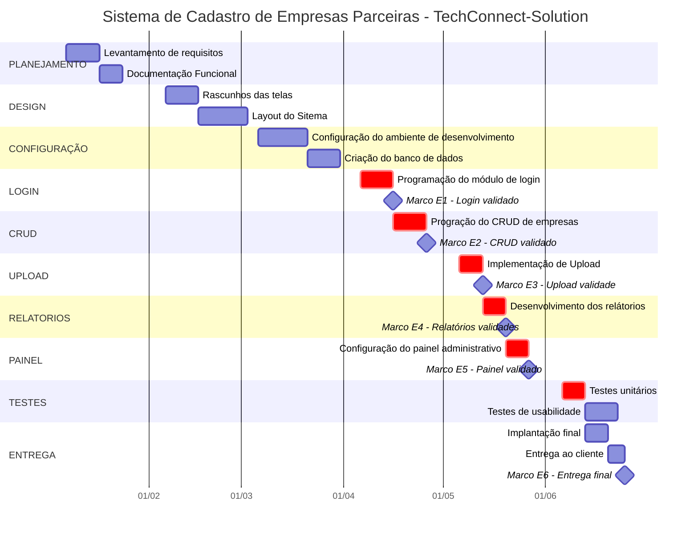
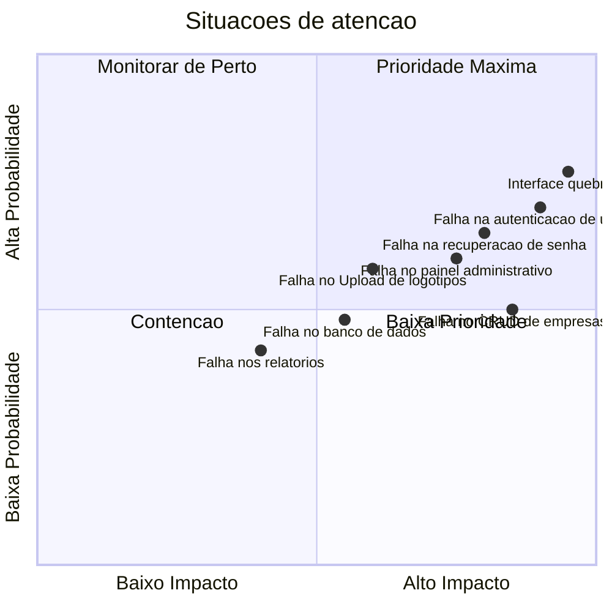

```mermaid
gantt
title Sistema de Cadastro de Empresas Parceiras - TechConnect-Solution
    dateFormat  YYYY-MM-DD
    axisFormat  %d/%m

section PLANEJAMENTO
Levantamento de requisitos :a1, 2026-01-07, 10d
Documentação Funcional :a2, after a1, 7d

section DESIGN
Rascunhos das telas :b1, 2026-02-06, 10d
Layout do Sitema :b2, after b1, 15d

section CONFIGURAÇÃO
Configuração do ambiente de desenvolvimento :c1, 2026-03-06, 15d
Criação do banco de dados :c2, after c1, 10d

section LOGIN
Programação do módulo de login :crit, d1, 2026-04-06, 10d
Marco E1 - Login validado :milestone, after d1, 0d

section CRUD
Progração do CRUD de empresas :crit, e1, 2026-04-16, 10d
Marco E2 - CRUD validado :milestone, after e1, 0d

section UPLOAD
Implementação de Upload :crit, f1, 2026-05-06, 7d
Marco E3 - Upload validade :milestone, after f1, 0d

section RELATORIOS
Desenvolvimento dos relátorios :crit, g1, 2026-05-13, 7d
Marco E4 - Relatórios validades :milestone, after g1, 0d

section PAINEL
Configuração do painel administrativo :crit, h1, 2026-05-20, 7d
Marco E5 - Painel validado :milestone, after h1, 0d

section TESTES
Testes unitários :crit, i1, 2026-06-06, 7d
Testes de usabilidade :i2, after i1, 10d

section ENTREGA
Implantação final :j1, 2026-06-13, 7d
Entrega ao cliente :j2, after j1, 5d
Marco E6 - Entrega final :milestone, after j2, 0d
```

```mermaid
quadrantChart
    title Situacoes de atencao
    x-axis Baixo Impacto --> Alto Impacto
    y-axis Baixa Probabilidade --> Alta Probabilidade

    quadrant-1 Prioridade Maxima
    quadrant-2 Monitorar de Perto
    quadrant-3 Contencao
    quadrant-4 Baixa Prioridade

    Falha na autenticacao de usuario: [0.90, 0.70]
    Falha na recuperacao de senha: [0.80, 0.65]
    Falha no CRUD de empresas: [0.85, 0.50]
    Falha no Upload de logotipos: [0.60, 0.58]
    Falha nos relatorios: [0.40, 0.42]
    Falha no painel administrativo: [0.75, 0.60]
    Interface quebrada: [0.95, 0.77]
    Falha no banco de dados: [0.55, 0.48]
```

